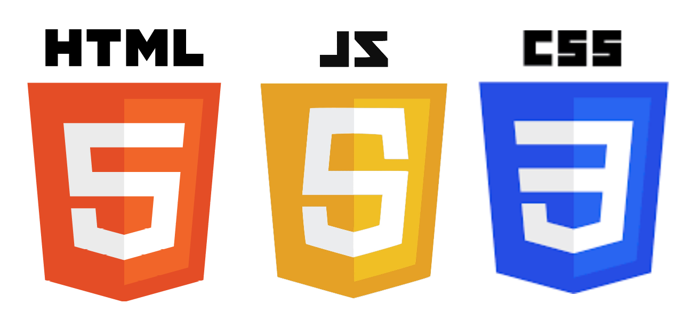
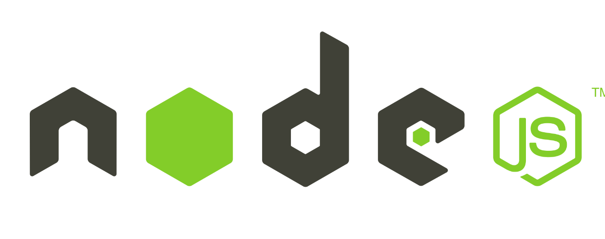
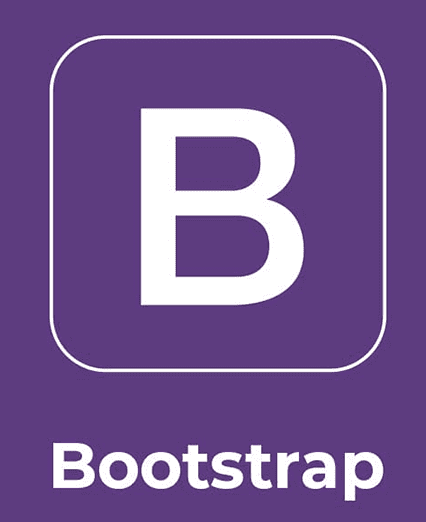

:imagesdir: 

//Comment: con imagesdir hemos añadido la ubicacion de todas las imagenes del documento para no tener que pasar el path cada vez.

= [underline]#*Tecnoètica*#

:author: Adrià Ballesteros, Iván Dominguez, Antonio Gálvez
:revdate: 13/05/2021
:revnumber: 1.0
:title-page: MP12 - Projecte

====
Bienvenidos a nuestro proyecto para la realización de Fichas orientadas a un estudio academico
====

== Construido con

[.float-group]
--
  

 

image::img/php.png[Logophp, 40%]
image::img/mysql.png[Logomysql, 40%]
--

== Nosotros

Nuestra empresa *Tecnoticos S.L.* esta compuesta por nuestros cuatro compañeros: +
 
* Adrià Ballesteros - https://github.com/AdriaBallesteros[Espacio Personal]
* Iván Dominguez - https://github.com/IvanDominguez2000[Espacio Personal] 
* Antonio Gálvez - https://github.com/agmdaw2[Espacio Personal]

== Licencia
image::img/LicenciaCC.png[Licencia] 

//si en vez de poner doble : ponemos 1 la siguiente linea sera continua y no habra el salto.

Este proyecto está bajo la Licencia Creative Commons.

== Agradecimientos
* A todo el personal del centro Nicolau Copernic que ha podido hacer posible el proyecto. 
* A nuestros allegados por tranquilizarnos cuando algo no salia.
